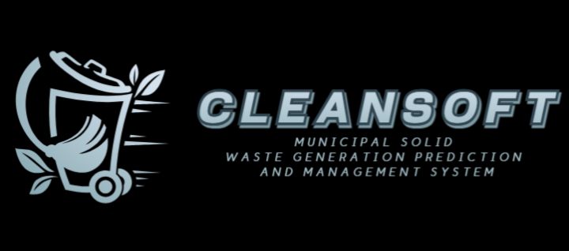
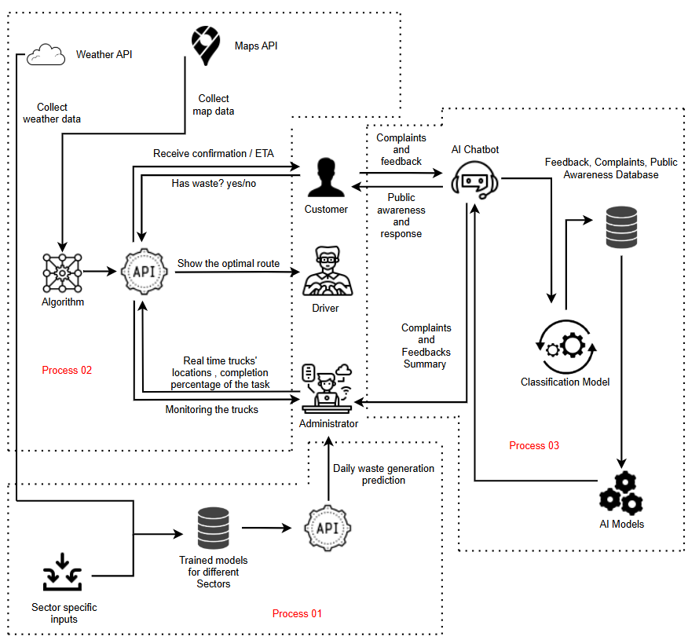
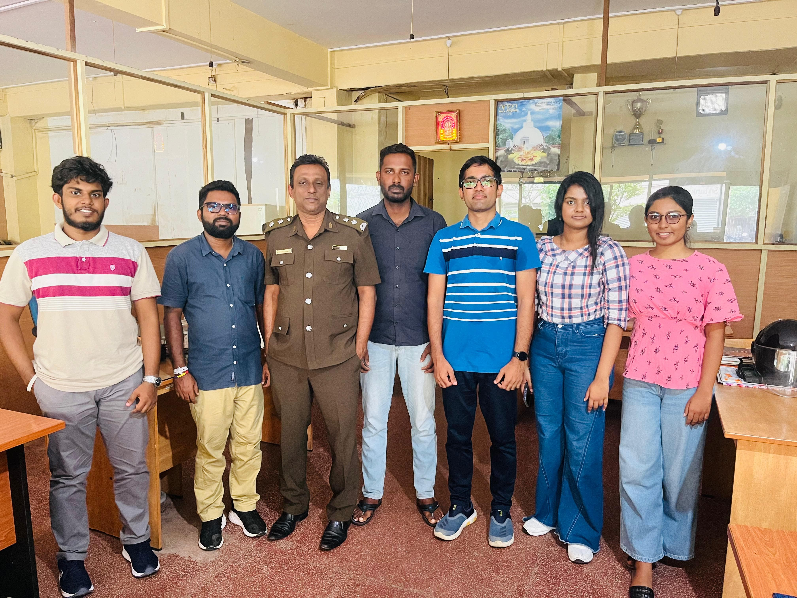
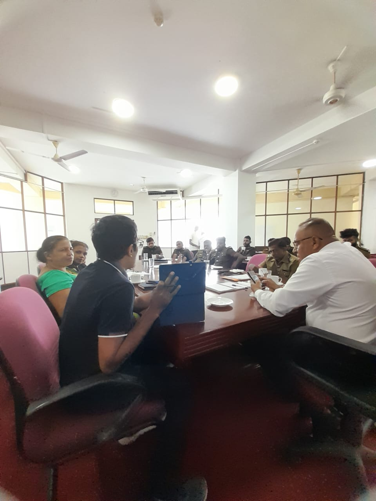
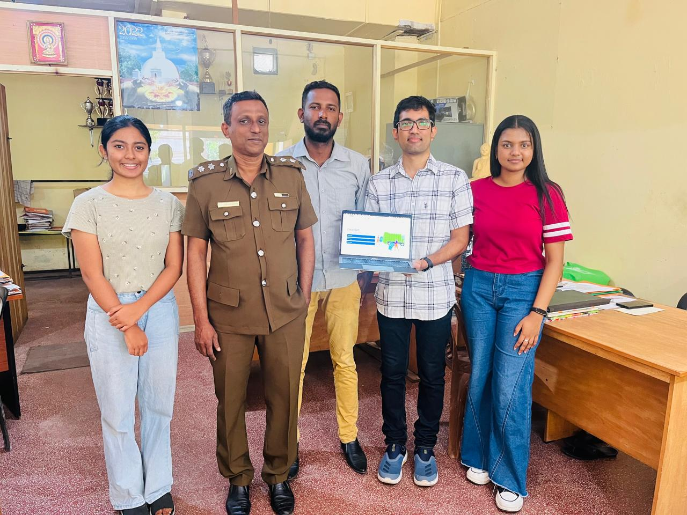
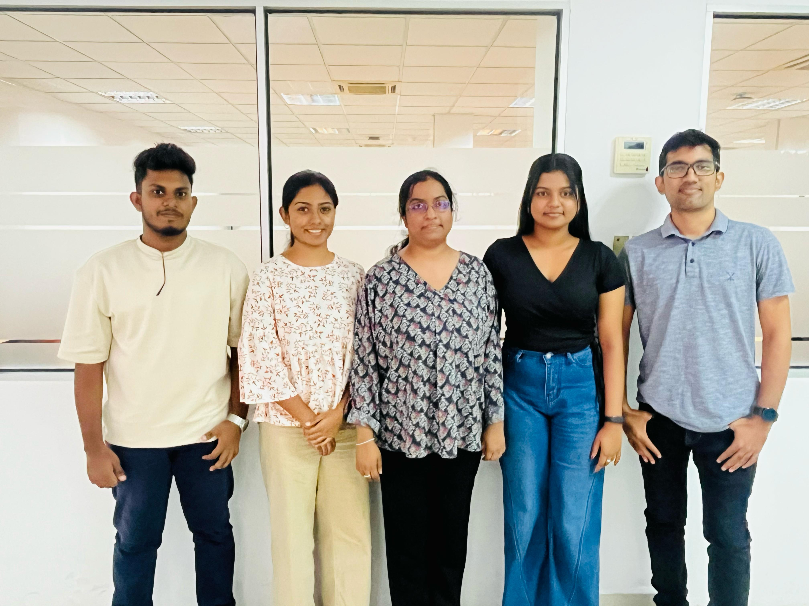

# Municipal Solid Waste Generation Prediction and Management System

## Introduction

We are AI and DS 2nd year students of Group 3 working on the project **“Municipal Solid Waste Generation Prediction and Management System”** in partnership with the Mt. Lavinia Municipal Council. Our project leverages advanced data analytics and AI to predict waste generation and optimize collection routes, helping municipalities manage waste more efficiently.

## Team Members

- **Chirath Setunge (Leader)**
- **Gihanga Sandothmi**
- **Dharani Gamage**
- **Himan Withana**

## Leadership & Mentorship

- **Module Leader:** Mr. Prasan Yapa
- **Mentor:** Dr. Kasuni Welihinda

## Project Features

### Waste Prediction
- **Focus:** Household and Hospital Waste  
- **Description:** Using advanced AI models, we accurately forecast waste levels from households and hospitals.

### Optimized Waste Collection Route
- **Description:** We design optimized routes to maximize efficiency and reduce collection costs.

### Interactive Chatbot
- **Description:** Our interactive chatbot provides real-time assistance and system management.

# Feature Prototype 

# Some of Our Memories

